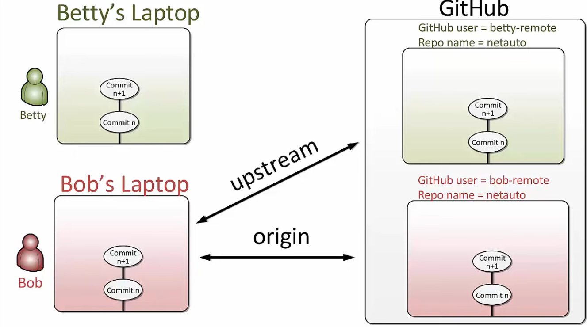

# learn git

[Video](https://www.youtube.com/watch?v=_OZVJpLHUaI&list=PL55RiY5tL51poFMpbva1IqfO-pylwSNsN) | [Video](https://www.youtube.com/watch?v=RGOj5yH7evk) | [Video](https://www.youtube.com/watch?v=FyAAIHHClqI&list=RDQMRp2bFDrBoXg&start_radio=1) | https://academind.com/learn/web-dev/git-the-basics/

## BASIC

### git init [projectname]

### git add .

    - staging changes, 
    -. add all new files and modified files.
    This snapshot is now stored in a temporary staging area which Git calls the "index". You can permanently store the contents of the index in the repository with git commit.

### git commit -m "commits"

    - commit changes.

    -a --all: Cause stage and commit. Tell the command to automatically stage files that have been modified and deleted, BUT new files you have not told Git about are not affected.

## STATUS

### git status

    - get a brief summary of the situation, displaying the state of files in working tree and staging area.

### git diff [--staged]

    - git diff will show you any changes that you’ve made but not yet added to the index. i.e. show the difference between the tracked file in working tree and the staging area, but no new added file which is not tracked yet.

    --staged /--cached, show uncommited but staged. You can see what is about to be committed using git diff --staged

### git log

    - At any point you can view the history of your changesgit log --stat --summary

    - git log --all --decorate --oneline --graph

    - p: show the detailed changes.

### gitk

    - Show a nice graphical representation of the resulting history.

### git help [log]

    - Go to git help

## BRANCH

    git-branch - List, create, or delete branches

### git branch [-r/a]

    - List, create, or delete branches

    -r --remotes: List or delete (if used with -d) the remote-tracking branches. Combine with --list to match the optional pattern(s).

    -a --all: List both local and remote branches

### git branch [branchname]

    - Create a new branch
    
    - Branch is a pointer to point to the SHA-1 hash of a commit
    - HEAD is a pointer pointing to the branch which we are on, tell us that we have that branch CHECKED OUT.
    - HEAD normally refers to a named branch (e.g. master). Meanwhile, each branch refers to a specific commit.

### git branch -d [new-feature]

    -d --delete: Delete a branch. The branch must be fully merged in its upstream branch, or in HEAD if no upstream was set with --track or --set-upstream-to.

    -D: Shortcut for --delete --force.

### git branch --merged

    - Find all branches which can be safely deleted, since those branches are fully contained by HEAD.
    --no-merged is used to find branches which are candidates for merging into HEAD, since those branches are not fully contained by HEAD.

## CHECKOUT

    git-checkout - Switch branches or restore working tree files

### git checkout [branchname]

    - Switch branches or restore working tree files
    - to checkout, first need to update working tree and staging area, so ABORT if there are uncommited local changes. 
    - Your local changes to the following files would be overwritten by checkout. Please commit your changes or stash them before you switch branches.

    - To prepare for working on <branch>, switch to it by updating the index and the files in the working tree, and by pointing HEAD at the branch. Local modifications to the files in the working tree are kept, so that they can be committed to the <branch>.

### git checkout -b [new-feature]

    - CREATE a new Branch named "new-feature"
    - Specifying -b causes a new branch to be created as if git-branch[1] were called and then checked out.
    - Conbine git branch feature & git checkout feature

#### git checkout -- filename

    Overide the unstaged working tree changes.

    Replace the modified file in working tree with the previous version which is still in the stage area, so discarding new changes.

### git checkout [commitId] -- filename

    Restore the file version back to staging area and working tree.

### git checkout [commitId]

    - HEAD now refers directly to commitId. This is known as being in detached HEAD state. It means simply that HEAD refers to a specific commit, as opposed to referring to a named branch. 

    - git checkout main : move HEAD back to main
    - git branch [branchname]: name the commitId a new branch:

### git checkout -- .

    REMOVE unstaged changes

    - git restore [filename]

[video](https://www.youtube.com/watch?v=mVnZVw4KJnc&list=PL55RiY5tL51poFMpbva1IqfO-pylwSNsN&index=2) | [video](https://www.youtube.com/watch?v=Gg4bLk8cGNo) | https://academind.com/tutorials/github-the-basics

## REMOTE

    VS Code Plugin doesn't work well with github, but it did creat the remote git, So change from https: to ssh and CLI

### git remote -v

    - git remote -v: Displays all remote Respositories your local Repository is connected to ("-v" also shows the URL of the remote Repository)

### git remote add origin git@github.com:xxx/ts.git

    - git remote add origin URL: Establishes a connection between the local Git Repository you're currently working on and the remote Repository (URL should be the URL of this Repository)
    - need to first create repository online

### git remote rm origin

    - git remote rm origin: Removes the connection between the local Repository and the remote Repository, "origin" is the remote Repository`s name
    - Remove the remote named <name>. All remote-tracking branches and configuration settings for the remote are removed.

## PUSH

### git push -u origin main

    - Push (i.e. upload) the content of our local Repository to the remote one. 
    
    -u origin main instructs Git to create an upstream to a specific Branch and Repository, meaning that we want to upload data to the "master" Branch of our "origin" Repository.
    
    --u --set-upstream
    For every branch that is up to date or successfully pushed, add upstream (tracking) reference, used by argument-less git-pull[1] and other commands. For more information, see branch.<name>.merge in git-config[1].

### git push

    - git push origin main
    - git push and git pull, Only possible after a remote tracking Branch was created

## Pull

### git clone https://xxx

    ### git fetch

    ### git main

    ### git merge origin/main

### git fetch origin

    Get updated status of origin
    - then git-status or git-log to get updated logs
    - git merge origin/main to merge to local main

### git pull

    combine git-fetch and git merge commands.

    More precisely, git pull runs git-fetch with the given parameters and then depending on configuration options or command line flags, will call either git-rebase or git-merge to reconcile diverging branches.

## MERGE

### 1. git merge new-feature

    - MERGE branch to current branch

    - Incorporates changes from the named commits (since the time their histories diverged from the current branch) into the current branch. This command is used by git pull to incorporate changes from another repository and can be used by hand to merge changes from one branch into another.

#### fast forward merge

    - git status
    - git diff main..new-feature
    - git merge new-feature
    - git log --all --decorate --oneline --graph
    - git branch --merged
    - git branch -d new-feature

#### three-way merge without conflicts

    - git status
    - git diff main..new-feature
    - git merge another-feature
    - git status
    - git log --all --decorate --oneline --graph
    - git branch --merged
    - git branch -d new-feature

#### thee-way merge with conflicts

    - git status
    - git diff main..new-feature
    - git merge another-feature
    - git merge --abort
      do again
    - git merge another-feature
      edit file with comflicts
    - git add filename
    - git status
    - git commit
      edit commits
    - git log --all --decorate --oneline --graph
    - git branch --merged
    - git branch -d new-feature

### 2.1 git merge --squash feature

    --squash: Summarize all the commits in feature and then merge this merged commit  to main branch on top of its latest commit, but stopped before committing it.

    Produce the working tree and index state as if a real merge happened (except for the merge information), but do not actually make a commit, move the HEAD, or record $GIT_DIR/MERGE_HEAD (to cause the next git commit command to create a merge commit). This allows you to create a single commit on top of the current branch whose effect is the same as merging another branch (or more in case of an octopus).

    Unmerged paths:
    (use "git restore --staged <file>..." to unstage)
    (use "git add <file>..." to mark resolution)

### 2.2 git commit -m "main and feature merged"

    commit the feature commit to main.
    m1-m2-m3-"main and feature merged"(including f1+f2)

### 3 git rebase XXX

## RESET

### git rm filename

    Remove file from repo.

    Remove files from the working tree and from the index
    - git rm -f git-*.sh

### git reset HEAD filename

    Unstage a snapshot.

    Restore the file from the latest commit to stage, but don't change file in the working tree, changing it by git checkout -- filename.
    HEAD refer to the most recent commit.

### git reset [filename]

    Undo git add.
    - use "git restore --staged <file>..." to unstage
    - use "git restore <file>..." to discard changes in working directory

### git reset HEAD~1

    Undo a commit

### git reset [commitId]

    Undo commitId

### git reset -hard [commitId]

    Remove and go back to previous commit

## STASH

### git stash

    Save your local modifications to a new stash entry and roll them back to HEAD (in the working tree and in the index). 
    -m or git stash push -m "" : The <message> part is optional and gives the description along with the stashed state.

### git stash list

### git stash drop [0]

    Remove a single stash entry from the list of stash entries.

### git stash clear

    Clear all stash

### git stash apply

    Bring the stash back and apply it on top of the current working tree state,

## UPSTREAM

### git remote add upstream git@github.com:forked/project.git

### git remote remove upstream

### git fetch upstream

### git merge upstream/main

### git push origin new-feature

### git log --graph --oneline -all

## CONFIG

    $ git config --global user.name "Your Name"
    $ git config --global user.email "email@example.com"

    显示当前的 git 配置信息：

    >git config --list //显示当前的 git 配置信息：

    编辑 git 配置文件:

    > git config -e    # 针对当前仓库
    > git config -e --global   # 针对系统上所有仓库

    设置提交代码时的用户信息：

    $ git config --global user.name "runoob"
    $ git config --global user.email test@runoob.com

    如果去掉 --global 参数只对当前仓库有效。

## Basic Commands

Individual Developer (Standalone)
A standalone individual developer does not exchange patches with other people, and works alone in a single repository, using the following commands.

### git-init[1] to create a new repository.

### git-log[1] to see what happened.

### git-switch[1] and git-branch[1] to switch branches.

### git-add[1] to manage the index file.

### git-diff[1] and git-status[1] to see what you are in the middle of doing.

### git-commit[1] to advance the current branch.

### git-restore[1] to undo changes.

### git-merge[1] to merge between local branches.

### git-rebase[1] to maintain topic branches.

### git-tag[1] to mark a known point.

    git log =  git history
    git log --all --decorate --oneline --graph = commit history graph
    git branch (branch-name) = create a branch
    git checkout (branch-name) = checkout a branch/move head pointer
    git commit -a -m "commit message" = commit all modified and tracked files in on command (bypass separate 'git add' command)
    git diff master..SDN = diff between 2 branches
    git merge (branch-name) = merge branches (fast-forward and 3-way merges)
    git branch --merged = see branches merged into the current branch
    git branch -d (branch-name) = delete a branch, only if already merged
    git branch -D (branch-name) = delete a branch, including if not already merged (exercise caution here)
    git merge --abort = abort a merge during a merge conflict situation
    git checkout (commit-hash) = checkout a commit directly, not through a branch, results in a detached HEAD state
    git stash = create a stash point
    git stash list = list stash points
    git stash list -p = list stash points and show diffs per stash
    git stash apply = apply most recent stash
    git stash pop = apply most recent stash, and remove it from saved stashes
    git stash apply (stash reference) = apply a specific stash point
    git stash save "(description)" = create a stash point, be more descriptive

    Retrieve/Clone a repo = git clone (URL)
    List remotes = git remote (-v for detail)
    Commit graph = git log --all --decorate --oneline --graph
    Checkout a branch = git checkout
    Create and checkout a branch = git checkout -b (branch name)
    Retrieve/download from a remote = git fetch (remote name)
    merge branch or tracking-branch = git merge (branch or tracking branch name)
    Show status = git status
    Upload to a remote = git push (remote name) (branch name)
    stage an edit = git add (filename)
    make a commit = git commit -m "description"
    stage and commit = git commit -a -m "description"
    List local branches = git branch
    List remote branches = git branch -r
    List both local and remote branches = git branch -a

## Glosary

### branch

    A "branch" is a line of development. The most recent commit on a branch is referred to as the tip of that branch. The tip of the branch is referenced by a branch head, which moves forward as additional development is done on the branch. A single Git repository can track an arbitrary number of branches, but your working tree is associated with just one of them (the "current" or "checked out" branch), and HEAD points to that branch.

### checkout

    The action of updating all or part of the working tree with a tree object or blob from the object database, and updating the index and HEAD if the whole working tree has been pointed at a new branch.

### commit

    As a noun: A single point in the Git history; the entire history of a project is represented as a set of interrelated commits. The word "commit" is often used by Git in the same places other revision control systems use the words "revision" or "version". Also used as a short hand for commit object.

    As a verb: The action of storing a new snapshot of the project’s state in the Git history, by creating a new commit representing the current state of the index and advancing HEAD to point at the new commit.

### fetch

    Fetching a branch means to get the branch’s head ref from a remote repository, to find out which objects are missing from the local object database, and to get them, too. See also git-fetch[1].

### head

    A named reference to the commit at the tip of a branch. Heads are stored in a file in $GIT_DIR/refs/heads/ directory, except when using packed refs. (See git-pack-refs[1].)

### HEAD

    The current branch. In more detail: Your working tree is normally derived from the state of the tree referred to by HEAD. HEAD is a reference to one of the heads in your repository, except when using a detached HEAD, in which case it directly references an arbitrary commit.

### index

    A collection of files with stat information, whose contents are stored as objects. The index is a stored version of your working tree. Truth be told, it can also contain a second, and even a third version of a working tree, which are used when merging.

### master

    The default development branch. Whenever you create a Git repository, a branch named "master" is created, and becomes the active branch. In most cases, this contains the local development, though that is purely by convention and is not required.

### merge

    As a verb: To bring the contents of another branch (possibly from an external repository) into the current branch. In the case where the merged-in branch is from a different repository, this is done by first fetching the remote branch and then merging the result into the current branch. This combination of fetch and merge operations is called a pull. Merging is performed by an automatic process that identifies changes made since the branches diverged, and then applies all those changes together. In cases where changes conflict, manual intervention may be required to complete the merge.

    As a noun: unless it is a fast-forward, a successful merge results in the creation of a new commit representing the result of the merge, and having as parents the tips of the merged branches. This commit is referred to as a "merge commit", or sometimes just a "merge".

### origin

    The default upstream repository. Most projects have at least one upstream project which they track. By default origin is used for that purpose. New upstream updates will be fetched into remote-tracking branches named origin/name-of-upstream-branch, which you can see using git branch -r.

### pull

    Pulling a branch means to fetch it and merge it. See also git-pull[1].

### push

    Pushing a branch means to get the branch’s head ref from a remote repository, find out if it is an ancestor to the branch’s local head ref, and in that case, putting all objects, which are reachable from the local head ref, and which are missing from the remote repository, into the remote object database, and updating the remote head ref. If the remote head is not an ancestor to the local head, the push fails.

### rebase

    To reapply a series of changes from a branch to a different base, and reset the head of that branch to the result.

### repository

    A collection of refs together with an object database containing all objects which are reachable from the refs, possibly accompanied by meta data from one or more porcelains. A repository can share an object database with other repositories via alternates mechanism.

### working tree

    The tree of actual checked out files. The working tree normally contains the contents of the HEAD commit’s tree, plus any local changes that you have made but not yet committed.

    how Git uses the object database to represent a project’s history:

    "commit" objects refer to "tree" objects representing the snapshot of a directory tree at a particular point in the history, and refer to "parent" commits to show how they’re connected into the project history.

    "tree" objects represent the state of a single directory, associating directory names to "blob" objects containing file data and "tree" objects containing subdirectory information.

    "blob" objects contain file data without any other structure.

    References to commit objects at the head of each branch are stored in files under .git/refs/heads/.

    The name of the current branch is stored in .git/HEAD.

    $ git ls-files --stage
        100644 513feba2e53ebbd2532419ded848ba19de88ba00 0       file.txt
    $ git cat-file -t 513feba2
        blob
    $ git cat-file blob 513feba2
        hello world!
        hello world, again

### git commit

    by default git commit uses the index to create the commit, not the working tree; the "-a" option to commit tells it to first update the index with all changes in the working tree.

### https://git-scm.com/docs/gitcore-tutorial